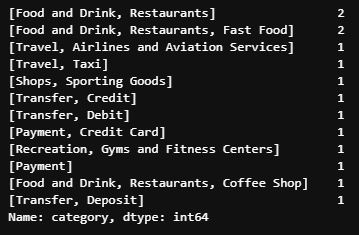
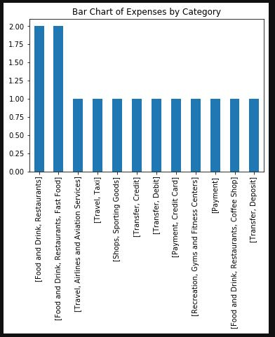
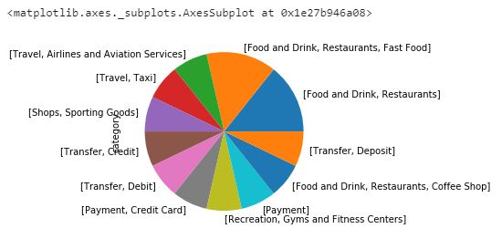
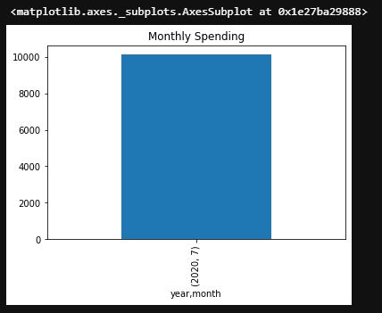
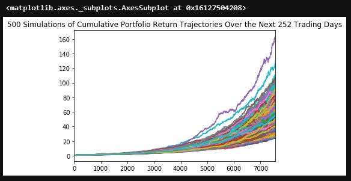
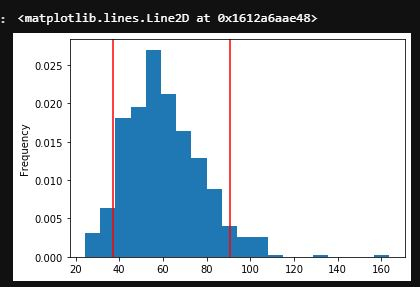
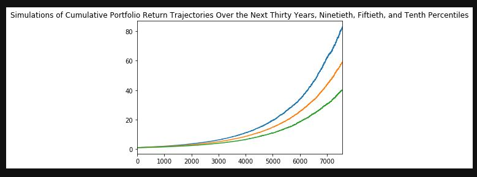
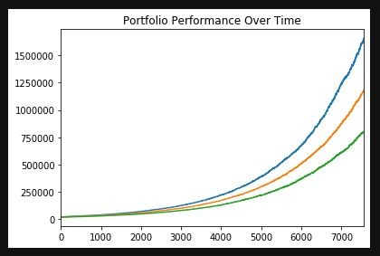

# Financial Report

Retirement Planning: Summarize the retirement portfolio analysis and include the charts for the Monte Carlo simulation.

Optional Challenge — Early Retirement
Harold was really impressed with your work on this planner, but commented that 30 years seems like such a long time to wait to retire! Harold starts wondering if the retirement plan could be adjusted to retire earlier than normal. Try adjusting the portfolio to either include more risk (a higher stock than bond ratio) or to have a larger initial investment and rerun the retirement analysis to see what it would take to retire in 5 years instead of 30!

## Budget Analysis

From the table of expenses per category, it seems that expenditures of food and drink take a significant number of transactions. Directly below is the raw table for expenditures by category.

This raw table was converted into a bar chart (shown directly below) that indicates how expenditures of food and drink accounted for a great deal of transactions.

In addition, the expenditures were expressed in terms of a pie chart (shown directly below) that shows the distribution of expenditures.

Monthly expenditures were also calculated and expressed in terms of a bar chart directly below (the time of submission of this assignment determined the singularity of the bar).

## Retirement Planning

The trajectories of simulated projections for the portfolio were given. These trajectories are provided in the graph below.

In addition, the distribution of the ending returns was set in a graph with the ninety percent confidence interval bound by vertical red bars (directly below).

## Challenges

In terms of the optional challenge, the simulations of the portfolio with different trajectories based on percentile (of return) were provided as a function of time (provided directly below).

Also, in terms of the optional challenge, the portfolio performance over time was graphed with different trajectories based on percentile (of return) were provided as a function of time (provided directly below).

There were optional challenges of trying to gain more money for retirement by starting with an increased investment (more than twenty thousand dollars) and by investing with more risk. The student author calculated and listed

