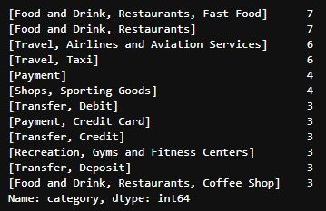
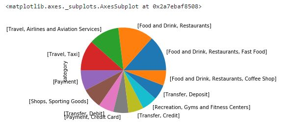
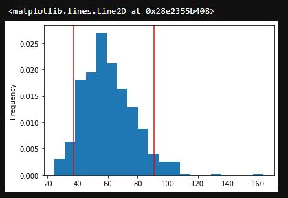

# Financial Report

## Budget Analysis

From the table of expenses per category, it seems that expenditures of food and drink take a significant number of transactions. Directly below is the raw table for expenditures by category. This raw table indicates the number of expenditures for each category.

This raw table was converted into a bar chart (shown directly below) that indicates how expenditures of food and drink accounted for a great deal of transactions. The bar chart provides an illustration in terms of the distribution of expenditures by category.

In addition, the expenditures were expressed in terms of a pie chart (shown directly below) that shows the distribution of expenditures. The pie chart allows the reader to compare expenditures by category.

Monthly expenditures were also calculated and expressed in terms of a bar chart directly below (the time of submission of this assignment determined the singularity of the bar). This bar chart provides an illustration of the amount of money spent in July 2020.

## Retirement Planning

The trajectories of simulated projections for the portfolio were given. These trajectories are provided in the graph below. The Monte Carlo simulation gave a possible growth pattern for the portfolio.

In addition, the distribution of the ending returns was set in a graph with the ninety percent confidence interval bound by vertical red bars (directly below). The possibilities for the ending returns were arranged (as a prelude to a standardized (aka bell) curve), and the area between the vertical red bars marks 90% of the realm of possibilities for outcomes.

## Challenges

For the optional challenge, the simulations of the portfolio with different trajectories based on percentile (of return) were provided as a function of time (provided directly below).

Also, in terms of the optional challenge, the portfolio performance over time was graphed with different trajectories based on percentile (of return) were provided as a function of time (provided directly below). The percentiles were for the ninety-fifth, fiftieth, and fifth percentiles. 

There were optional challenges of trying to gain more money for retirement by starting with an increased investment (more than twenty thousand dollars) and by investing with more risk. The student author calculated and listed the percentiles based on bigger initial investments (increased by one and a half, doubled, tripled). The student author also made a graph (presented below) of the projected portfolio returns with greater risk, that is, the weight of stock and bond as .9 and .1 (that is, 90% stock and 10% bond).

